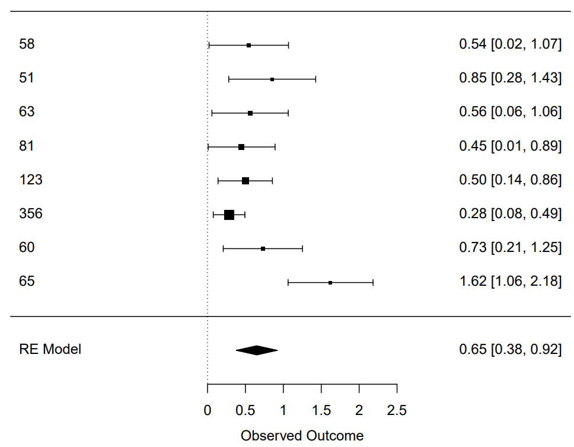

class: middle, inverse

```{r setup, include=FALSE}
knitr::opts_chunk$set(echo = FALSE, dev='jpeg', message = FALSE, warning = FALSE, dpi = 100)
```

```{r xaringan-themer, include=FALSE, warning=FALSE}
library(xaringanthemer)

style_mono_accent(
  #primary_color = "#D6D6CE",
  #secondary_color = "#800000",
  base_color = "#800000",
  header_font_google = google_font("Josefin Sans"),
  text_font_google   = google_font("Lora"),
  #text_font_size = "22px",
  code_font_google   = google_font("Fira Mono"),
  title_slide_background_image = "https://cpb-us-w2.wpmucdn.com/voices.uchicago.edu/dist/e/2560/files/2019/04/UChicago_Phoenix-Maroon.jpg",
  title_slide_background_position = "top",
  title_slide_background_size = "100%"
)
```

```{r console of "xaringanExtra", echo=FALSE}

library(xaringanExtra)

xaringanExtra::use_tile_view()

```

```{css scroll control, echo=FALSE}

.remark-slide-scaler {
    overflow-y: auto;
    overflow-x: auto;
}

.remark-slide-number {
    display: none;
}

.remark-code {
  display: block;
  overflow-x: auto;
  padding: .5em;
  color: #333;
  background: #f8f8f8;
}

```

# Findings for now

Integral anxiety, rather than incidental anxiety, will lead to unethical behavior.

- A replication study failed to replicate the effect of incidental anxiety on unethical decision making.

- Two correlational studies suggested that workplace (integral) anxiety was positively associated with unethical pro-organizational behavior (UPB).

- A large-scale dataset (N = 350787) showed that the correlation coefficients between emotions and moral judgment were negligibly small, ranging from -.03 to .034.

- Although several studies consistently reported that incidental anxiety could cause unethical behavior, two meta-analyses indicated that there may be a publication and report bias in the literature.

---

class: center, middle, inverse

# Replication of Kouchaki & Desai (2015) Study 1 

---

### Kouchaki & Desai (2015) Study 1, summary

In Kouchaki & Desai (2015) Study 1, participants were 58 students. 

In the anxiety condition, participants listened to the theme music from the movie Psycho. In the neutral condition, they listened to Handel’s Water Music: Air. 

The likelihood to engage in unethical behavior was measured using **eight scenarios**. 1 (not at all likely) to 7 (highly likely), alpha = .78.


- You work in a fast-food restaurant in downtown your city. It’s against policy to eat food without paying for it. You came straight from classes and are therefore hungry. Your supervisor isn’t around, so you make something for yourself and eat it without paying.

- You work as an office assistant for a department at your university. You’re alone in the office making copies and realize you’re out of copy paper at home. You therefore slip a ream of paper into your backpack.

- You’re preparing for the final exam in a class where the professor uses the same exam in both sections. Some of your friends somehow get a copy of the exam after the first section. They are now trying to memorize the right answers. You don’t look at the exam, but just ask them what topics you should focus your studying on.

---

### Kouchaki & Desai (2015) Study 1, summary

- You’ve waited in line for 10 minutes to buy a coffee and muffin at Starbucks. When you’re a couple of blocks away, you realize that the clerk gave you change for $20 rather than for the $10 you gave him. You savor your coffee, muffin and free $10.

- You get the final exam back from your professor and you notice that he’s marked correct three answers that you got wrong. Revealing his error would mean the difference between an A and a B. You say nothing.

- Your accounting course requires you to purchase a software package that sells for $50. Your friend, who is also in the class, has already bought the software and offers to lend it to you. You take it and load it onto your computer.

- Your boss at your summer job asks you to get confidential information about a competitor’s product. You therefore pose as a student doing a research project on the competitor’s company and ask for the information.

- You are assigned a team project in one of your courses. Your team waits until the last minute to begin working. Several team members suggest using an old project out of their fraternity/sorority files. You go along with this plan.

---

### Kouchaki & Desai (2015) Study 1, summary

Finally, participants were asked to rate their emotions while they were listening to music clips. They used **nervous, anxious, worried, and apprehensive** (alpha = .88) to measure anxiety. 1 (very slightly or not at all) to 5 (extremely).

**The manipulation of anxiety was successful**. Participants in the anxiety condition reported more anxiety (M = 2.42, SD = .93) than did participants in the neutral condition (M = 1.33, SD = .37), t(56) = -6.01, p < .001. 

**In support of the hypothesis, there was a significant difference between the two conditions on the dependent variable.** Participants in the anxiety condition indicated that they were more likely to engage in the described unethical behavior (M = 3.43, SD = 1.22) than those in the neutral condition (M = 2.80, SD = 1.06), t(56) = -2.10, ***p = .041***.

---

### Our replication, reliability analyses

```{r load package, echo = FALSE, warning = FALSE, message = FALSE, include=FALSE}
library(tidyverse)
library(lubridate)
library(bruceR)
```

```{r message=FALSE, warning=FALSE, include=FALSE}
d1 <- read_csv("D:\\R Projects\\Slides\\Thesis Analyses\\tidied_253.csv")

d1 <- d1 %>% 
  # filter finished responses, later than 6/11/2021, 6:01:17, this is the formal sample
  filter(StartDate > ymd_hms("2021-06-11 07:00:00")) %>% 
  filter(Finished == 1)
```

```{r, echo=FALSE}
# compute means
d1 <- d1 %>% 
  mutate(unethical_behavior = MEAN(d1, "UnethiBehav", 1:8)) %>% 
  mutate(random_behavior = MEAN(d1, "RandomBehav", 1:5)) %>% 
  mutate(anxiety = MEAN(d1, "Emotions", 1:4)) %>% 
  mutate(neutral = MEAN(d1, "Emotions", 5:8)) %>%
  mutate(identity = MEAN(d1, "Moral_Identify_", 1:10, rev=c(3,4), likert=1:5))
```

```{r, include=FALSE}
# show size of conditions
d1$FL_5_DO <- as.factor(d1$FL_5_DO)
summary(d1$FL_5_DO)
```

We included an additional control condition by asking participants to listen to a calm delta wave clip. The sample size was 161.

**Anxious emotions: Cronbach’s α = 0.943, McDonald’s ω = 0.944**

```{r, comment='#'}
#print("Alpha of anxiety")
bruceR::Alpha(d1, "Emotions", 1:4)
```

---

### Our replication, reliability analyses

**Unethical decision making: Cronbach’s α = 0.677, McDonald’s ω = 0.689**

```{r, comment="#"}
#print("Alpha of unethical behavior")
bruceR::Alpha(d1, "UnethiBehav", 1:8)
```

---

### Our replication, data visualization

The reliability analyses suggest that the measures are reliable, and we can average the items to a single measure for each construct. 

The raincloud plot below combines a probability density function, jittered data points, **a mean represented by the red dot**, and a box plot. **The plot suggests that the likelihood of unethical decision making does not differ a lot between conditions**.

```{r}
library(gghalves)
library(viridisLite)
library(viridis)
# Raincloud plot with repeated measurements


d1 %>%                 # define dataframe
  ggplot(aes(x = FL_5_DO,       # define x var
             y = d1$unethical_behavior)) + # define y var
  geom_point(aes(color = FL_5_DO),
             position = position_jitter(width=.1),
             size=.5, alpha=.8) +
  scale_color_viridis(option="cividis",discrete=T) + # add color palette
  scale_fill_viridis(option="cividis",discrete=T) +
  stat_summary(fun=mean,       # this indicates we want the mean statistic
               geom="point",   # we want the mean to be represented by a geom
               shape=21,       # use shape 21 (a circle with fill) for the mean
               size=1.5, col="black", fill="red") +
  ###
  geom_half_boxplot(aes(fill=FL_5_DO),  # different colors for each level of x
                    side="r", outlier.shape=NA, center=TRUE, # styling for boxplots
                    position = position_nudge(x=.15),        # position of boxplots
                    errorbar.draw=FALSE, width=.2) +
  ####
  geom_half_violin(aes(fill=FL_5_DO),   # different colors for each level of x
                   bw=.45, side="r",                  # styling for the violin plot
                   position = position_nudge(x=.3))+
  # Optional styling
  coord_flip() +                          
  xlab("") +  # x-axis label
  ylab("Likelihood of Unethical Decision Making") + # y-axis label
  scale_y_continuous(breaks=seq(1,7,1)) + # y-axis ticks
  theme_minimal() + # apply minimal theme to hide many unnecessary features of plot
  theme(            # make modifications to the theme
    panel.grid.major.y=element_blank(),   # hide major grid for y axis
    panel.grid.minor.y=element_blank(),   # hide minor grid for y axis
    panel.grid.major.x=element_line(),    # show major grid for x axis
    panel.grid.minor.x=element_blank(),   # hide minor grid for x axis
    legend.position="none",
    text=element_text(size=10),           # font aesthetics 
    axis.text=element_text(size=10),
    axis.title=element_text(size=10,face=)) +
  scale_x_discrete(labels= c("Anxiety Condition (N = 54)", "Original Control (N = 51)", "Additional Control (N = 56)")) #+
 # ggtitle("Raincloud Plot of Unethical Decision Making")
```


---

### Our replication, data visualization

**The plot below suggests that our manipulation seems successful**.

```{r, echo=FALSE}
# Raincloud plot with repeated measurements


d1 %>%                 # define dataframe
  ggplot(aes(x = FL_5_DO,       # define x var
             y = anxiety)) + # define y var
  geom_point(aes(color = FL_5_DO),
             position = position_jitter(width=.1),
             size=.5, alpha=.8) +
  scale_color_viridis(option="cividis",discrete=T) + # add color palette
  scale_fill_viridis(option="cividis",discrete=T) +
  stat_summary(fun=mean,       # this indicates we want the mean statistic
               geom="point",   # we want the mean to be represented by a geom
               shape=21,       # use shape 21 (a circle with fill) for the mean
               size=1.5, col="black", fill="red") +
  ###
  geom_half_boxplot(aes(fill=FL_5_DO),  # different colors for each level of x
                    side="r", outlier.shape=NA, center=TRUE, # styling for boxplots
                    position = position_nudge(x=.15),        # position of boxplots
                    errorbar.draw=FALSE, width=.2) +
  ####
  geom_half_violin(aes(fill=FL_5_DO),   # different colors for each level of x
                   bw=.45, side="r",                  # styling for the violin plot
                   position = position_nudge(x=.3))+
  # Optional styling
  coord_flip() +                          
  xlab("") +  # x-axis label
  ylab("Anxiety Emotion") + # y-axis label
  scale_y_continuous(breaks=seq(1,7,1)) + # y-axis ticks
  theme_minimal() + # apply minimal theme to hide many unnecessary features of plot
  theme(            # make modifications to the theme
    panel.grid.major.y=element_blank(),   # hide major grid for y axis
    panel.grid.minor.y=element_blank(),   # hide minor grid for y axis
    panel.grid.major.x=element_line(),    # show major grid for x axis
    panel.grid.minor.x=element_blank(),   # hide minor grid for x axis
    legend.position="none",
    text=element_text(size=10),           # font aesthetics 
    axis.text=element_text(size=10),
    axis.title=element_text(size=10,face=)) +
  scale_x_discrete(labels= c("Anxiety Condition (N = 54)", "Original Control (N = 51)", "Additional Control (N = 56)")) # +
  # ggtitle("Raincloud Plot of Replication Study")
```

---

### Our replication, t-test, emotion

The means of **anxiety emotion** between anxiety condition and original control (ControlCondition_1) were **not significantly different** from each other (Note. `FL_5_DO` is the manipulation condition variable name).

```{r}
t.test(anxiety ~ FL_5_DO, filter(d1, FL_5_DO != "ControlCondition_2"))
```

---

### Our replication, t-test, emotion

The means of **anxiety emotion** between anxiety condition and additional control condition (ControlCondition_2) were **significantly different** from each other.

```{r}
t.test(anxiety ~ FL_5_DO, filter(d1, FL_5_DO != "ControlCondition_1"))
```

---

### Our replication, ANOVA, emotion

The analyses below show that the anxiety difference between anxiety condition and additional control, rather than the original control, contributes to our successful manipulation.

```{r}
m3 <- aov(anxiety ~ FL_5_DO, data = d1)
summary(m3)
tukey.m3 <- TukeyHSD(m3)
tukey.m3
```

---

### Our replication, t-test, unethical decision making

The means of **unethical decision making** between anxiety condition and the original control  (ControlCondition_1) were **not significantly different** from each other.

```{r}
t.test(unethical_behavior ~ FL_5_DO, filter(d1, FL_5_DO != "ControlCondition_2"))
```


---

### Our replication, t-test, unethical decision making

The means of **unethical decision making** between anxiety condition and the additional control (ControlCondition_2) were **not significantly different** from each other.

```{r}
t.test(unethical_behavior ~ FL_5_DO, filter(d1, FL_5_DO != "ControlCondition_1"))
```

---
### Our replication, ANOVA, unethical decision making

Not surprisingly, ANOVA indicates **no significant** unethical decision making difference between conditions. 

```{r}
m1 <- aov(unethical_behavior ~ FL_5_DO, data = d1)
summary(m1)
```

---

### Our replication, correlation, anxiety and unethical decision making

The correlation coefficient between anxiety emotion and unethical decision making is **not significant**.

```{r}
cor.test(d1$anxiety, d1$unethical_behavior)
```

---
### Our replication, plot, anxiety and unethical decision making

Although I fitted a regression line, we are not able to identify a clear association from the plot below.

```{r, message=FALSE}
library(ggExtra)

# scatterplot
f6 <- d1 %>%                           # defines dataframe
  ggplot(aes(x=anxiety, y=unethical_behavior)) +     # defines x and y axis variables
  
  # add observations to scatterplot
  geom_point(size=1, alpha=.7, colour="darkgrey") + # define size and colour
                                                    # alpha adds transparency
  # add fitted slope and 95% CIs
  geom_smooth(size=1,method=lm,colour="slateblue") + # define size and colour
                                                    # method=lm indicates linear slope
  
# optional styling
  scale_x_continuous(breaks=seq(1,5,0.5)) +  # x-axis tick marks
  scale_y_continuous(breaks=seq(1,7,0.5)) + # y-axis tick marks
  xlab("Anxiety") +                       # x-axis label
  ylab("Unethical Decision Making") +                       # y-axis
  theme_minimal() + # apply minimal theme to hide many unnecessary features of plot
  theme(            # make modifications to the theme
    panel.grid.major.y=element_line(),   # show major grid for y axis
    panel.grid.minor.y=element_line(),   # show minor grid for y axis
    panel.grid.major.x=element_line(),   # show major grid for x axis
    panel.grid.minor.x=element_line(),   # show minor grid for x axis
    text=element_text(size=8),          # font aesthetics 
    axis.text=element_text(size=8),
    axis.title=element_text(size=8,face=)) + 
  ggtitle("Scatterplot and Histograms of Anxiety and Unethical Decision Making")

# add marginal histograms (requires ggExtra package)
f6 <- ggMarginal(f6, type="histogram",     # add histograms to marginal plot
                   fill = "lightgrey",     # color of histograms
                   xparams = list(bins=20),# n of bins for x variable
                   yparams = list(bins=20)) 

  
  # n of bins for y variable

f6 
```

---

class: middle, inverse

## The manipulation of anxiety was (partially) successful. However, we observe no effect of incidental anxiety on the likelihood of unethical decision making, supporting the contention that incidental anxiety has no effect on ethical decision making.

---
class: center, middle, inverse

# Two Correlational Studies

---

### Full-time employee sample (N = 471)

We recruited this sample via an online platform.

**Workplace anxiety**. Eight items (McCarthy et al., 2016).
- I am overwhelmed by thoughts of doing poorly at work.

- I worry that my work performance will be lower than that of others at work.

- I feel nervous and apprehensive about not being able to meet performance targets.

- I worry about not receiving a positive job performance evaluation.

- I often feel anxious that I will not be able to perform my job duties in the time allotted.

- I worry about whether others consider me to be a good employee for the job.

- I worry that I will not be able to successfully manage the demands of my job.

- Even when I try as hard as I can, I still worry about whether my job performance will be good enough.

---

### Full-time employee sample (N = 471)

**Unethical pro-organizational behavior (UPB).** Six items assessed respondents’ agreement of their willingness to perform UPB (Umphress et al., 2010).
  - If it would help my organization, I would misrepresent the truth to make my organization look good.
  
  - If it would help my organization, I would exaggerate the truth about my company’s products or services to customers and clients.
  
  - If it would benefit my organization, I would withhold negative information about my company or its products from customers and clients.
  
  - If my organization needed me to, I would give a good recommendation on the behalf of an incompetent employee in the hope that the person will become another organization’s problem instead of my own.
  
  - If my organization needed me to, I would withhold issuing a refund to a customer or client accidentally overcharged.
  
  - If needed, I would conceal information from the public that could be damaging to my organization.

---

### Full-time employee sample (N = 471)

The correlation between workplace (integral) anxiety and UPB is **significantly positive**. (Note. m_mean = workplace anxiety. y_mean = UPB)

```{r}
employee_mod_tidy <- read.csv("D:/R Projects/UPB/employee_mod_tidy.csv")
MBA_mod_tidy <- read.csv("D:/R Projects/UPB/MBA_mod_tidy.csv")
```


```{r}
employee_mod_tidy <- mutate(employee_mod_tidy, 
       x_mean = rowMeans(select(employee_mod_tidy, x1:x3)), 
       m_mean = rowMeans(select(employee_mod_tidy, m1:m8)), 
       y_mean = rowMeans(select(employee_mod_tidy, y1:y6)),
       w_mean = rowMeans(select(employee_mod_tidy, w11:w20)))

MBA_mod_tidy <- mutate(MBA_mod_tidy, 
       x_mean = rowMeans(select(MBA_mod_tidy, x1:x3)), 
       m_mean = rowMeans(select(MBA_mod_tidy, m1:m8)), 
       y_mean = rowMeans(select(MBA_mod_tidy, y1:y6)),
       w_mean = rowMeans(select(MBA_mod_tidy, w11:w20)))
```


```{r}
cor.test(employee_mod_tidy$m_mean, employee_mod_tidy$y_mean)
```

---

### Full-time employee sample (N = 471)

The plot below visualizes the relationship between workplace anxiety and UPB in full-time employee sample.

```{r}
library(ggExtra)
f7 <- employee_mod_tidy %>%                           # defines dataframe
  ggplot(aes(x=m_mean, y=y_mean)) +     # defines x and y axis variables
  
  # add observations to scatterplot
  geom_point(size=1, alpha=.7, colour="darkgrey") + # define size and colour
                                                    # alpha adds transparency
  # add fitted slope and 95% CIs
  geom_smooth(size=1,method=lm,colour="slateblue") + # define size and colour
                                                    # method=lm indicates linear slope
  
# optional styling
  scale_x_continuous(breaks=seq(1,5,1)) +  # x-axis tick marks
  scale_y_continuous(breaks=seq(1,7,1)) + # y-axis tick marks
  xlab("Workplace Anxiety") +                       # x-axis label
  ylab("UPB") +                       # y-axis
  theme_minimal() + # apply minimal theme to hide many unnecessary features of plot
  theme(            # make modifications to the theme
    panel.grid.major.y=element_line(),   # show major grid for y axis
    panel.grid.minor.y=element_line(),   # show minor grid for y axis
    panel.grid.major.x=element_line(),   # show major grid for x axis
    panel.grid.minor.x=element_line(),   # show minor grid for x axis
    text=element_text(size=8),          # font aesthetics 
    axis.text=element_text(size=8),
     axis.title=element_text(size=8,face=)) + 
  ggtitle("Full-time employee sample (N = 471)")

# add marginal histograms (requires ggExtra package)
f7 <- ggMarginal(f7, type="histogram",     # add histograms to marginal plot
                   fill = "lightgrey",     # color of histograms
                   xparams = list(bins=20),# n of bins for x variable
                   yparams = list(bins=20)) 

  
  # n of bins for y variable

f7 
```

---

### MBA student sample (N = 283)

At the beginning of a course, MBA students were asked to fill the questionnaire containing work anxiety. At the end of the course, participants were asked to rate UPB.

The correlation between workplace (integral) anxiety and UPB is **significantly positive**. (Note. m_mean = workplace anxiety. y_mean = UPB)

```{r}
cor.test(MBA_mod_tidy$m_mean, MBA_mod_tidy$y_mean)
```

---

### MBA student sample (N = 283)

The plot below visualizes the relationship between workplace anxiety and UPB in MBA student sample.

```{r}
library(ggExtra)
f8 <- MBA_mod_tidy %>%                           # defines dataframe
  ggplot(aes(x=m_mean, y=y_mean)) +     # defines x and y axis variables
  
  # add observations to scatterplot
  geom_point(size=1, alpha=.7, colour="darkgrey") + # define size and colour
                                                    # alpha adds transparency
  # add fitted slope and 95% CIs
  geom_smooth(size=1,method=lm,colour="slateblue") + # define size and colour
                                                    # method=lm indicates linear slope
  
# optional styling
  scale_x_continuous(breaks=seq(1,5,1)) +  # x-axis tick marks
  scale_y_continuous(breaks=seq(1,7,1)) + # y-axis tick marks
  xlab("Workplace Anxiety") +                       # x-axis label
  ylab("UPB") +                       # y-axis
  theme_minimal() + # apply minimal theme to hide many unnecessary features of plot
  theme(            # make modifications to the theme
    panel.grid.major.y=element_line(),   # show major grid for y axis
    panel.grid.minor.y=element_line(),   # show minor grid for y axis
    panel.grid.major.x=element_line(),   # show major grid for x axis
    panel.grid.minor.x=element_line(),   # show minor grid for x axis
    text=element_text(size=8),          # font aesthetics 
    axis.text=element_text(size=8),
    axis.title=element_text(size=8,face=)) + 
  ggtitle("MBA Sample (N = 283)")

# add marginal histograms (requires ggExtra package)
f8 <- ggMarginal(f8, type="histogram",     # add histograms to marginal plot
                   fill = "lightgrey",     # color of histograms
                   xparams = list(bins=20),# n of bins for x variable
                   yparams = list(bins=20)) 

  
  # n of bins for y variable

f8 
```




---

class: middle, inverse


## I would argue that integral anxiety will lead to unethical behavior.

---

class: middle, inverse

# World Values Survey (WVS)

---

### WVS, moral judgment items

In the official excel file: 

Please tell me for each of the following statements whether you think it can always be justified, never be justified, or something in between, using this card. **1 never justifiable to 10 always justifiable**

- F114A (variable name in .csv), Claiming government benefits to which you are not entitled
- F115, Avoiding a fare on public transport
- F116, Cheating on taxes if you have a chance
- F117, Someone accepting a bribe in the course of their duties

***I chose these items because they were included in all the 7 waves of WVS data collection, and they are quite relevant to ethics.***

---

### WVS, moral judgment items

The analyses below show that it is reasonable to average these items to a single measure of moral judgment (Cronbach’s α = 0.762, McDonald’s ω = 0.770).

The averaged new item is `d_wvs$judgement`.

```{r}
d_wvs <- read_csv("D:/WVS/wvs_full_with_interested_time-series.csv")
```

```{r}
d_wvs <- d_wvs %>% 
  select(A008:C006, F114A:F117) %>% 
  filter_all(all_vars(. > 0))
```


```{r}
bruceR::Alpha(d_wvs, varrange="F114A:F117")
```
```{r}
d_wvs$judgement <- rowMeans(select(d_wvs, F114A:F117))
```

---

### WVS, correlation between incidental emotion and moral judgment (N = 350787)

Kouchaki & Desai (2015) argues that "state anxiety influences moral judgments and behaviors" (p. 361). An item might be the opposite of incidental state anxiety:

A170: All things considered, how satisfied are you with your life as a whole **these days**? 1 dissatisfied to 10 satisfied

This item, A170, looks like incidental satisfaction with life. As predicted, **the correlation between incidental satisfaction and moral judgment is quite small (r = -0.03)**.

```{r}
# satis with life
cor.test(d_wvs$A170, d_wvs$judgement)
```

---

### WVS, plotting for incidental emotion and moral judgment (N = 350787)

The Hexbin plot blow is not quite informative. It's easy to notice that the distribution of moral judgment is quite skewed.

```{r}
library(ggExtra)
f9 <- d_wvs %>%                           # defines dataframe
  ggplot(aes(x=A170, y=judgement)) +     # defines x and y axis variables
  
  # add observations to scatterplot
  #geom_point(size=0.1, alpha=.7, colour="darkgrey", position = position_jitter(width=.1)) + # define size and colour
                                                    # alpha adds transparency
  # add fitted slope and 95% CIs
  # geom_smooth(size=1,method=lm,colour="slateblue") + # define size and colour
                                                    # method=lm indicates linear slope
  
# optional styling
  scale_x_continuous(breaks=seq(1,10,1)) +  # x-axis tick marks
  scale_y_continuous(breaks=seq(1,10,1)) + # y-axis tick marks
  xlab("Satisfaction with life these days") +                       # x-axis label
  ylab("Moral judgment") +                       # y-axis
  theme_minimal() + # apply minimal theme to hide many unnecessary features of plot
  theme(            # make modifications to the theme
    panel.grid.major.y=element_line(),   # show major grid for y axis
    panel.grid.minor.y=element_line(),   # show minor grid for y axis
    panel.grid.major.x=element_line(),   # show major grid for x axis
    panel.grid.minor.x=element_line(),   # show minor grid for x axis
    text=element_text(size=8),          # font aesthetics 
    axis.text=element_text(size=8),
    axis.title=element_text(size=8,face=)) + 
  ggtitle("WVS Sample (N = 350787)") +
  geom_hex() +
  scale_fill_viridis_c() +
  geom_point(shape = '.', col = 'white')


# add marginal histograms (requires ggExtra package)
f9 <- ggMarginal(f9, type="histogram",     # add histograms to marginal plot
                   fill = "lightgrey",     # color of histograms
                   xparams = list(bins=20),# n of bins for x variable
                   yparams = list(bins=20)) 

  
  # n of bins for y variable

f9 
```

---

### WVS, correlation between happiness and moral judgment (N = 350787)

A008, feeling of happiness

- Taking all things together, would you say you are: 1 very happy to 4 not at all happy

- r = 0.034

```{r}
# happiness
cor.test(d_wvs$A008, d_wvs$judgement)
```

---

### WVS, correlation between subjective health and moral judgment (N = 350787)


A009, State of health (subjective)

- All in all, how would you describe your state of health these days? Would you say it is: 1 very good to 5 very poor

- r = 0.02

```{r}
# subjective health
cor.test(d_wvs$A009, d_wvs$judgement)
```

---

### WVS, correlation between financial situation and moral judgment (N = 350787)

C006, Satisfaction with financial situation of household

- How satisfied are you with the financial situation of your household? 1 dissatisfied to 10 satisfied

- r = -0.03

```{r}
# satis with financial 
cor.test(d_wvs$C006, d_wvs$judgement)
```

---

class: middle, inverse

# There is no evidence from WVS supporting the argument that (incidental) satisfaction and happiness (i.e., the emotions reversely related to anxiety) will affect moral judgment.

---

class: center, middle, inverse

# Meta Analysis

## Incidental Anxiety & Unethical Behavior

---

background-image: url("state anxiety meta input.png")
background-position: 25% 70%
background-size:


.center[
### Meta Analysis 
### Incidental Anxiety & Unethical Behavior
]

**Input: our replication not included.** 

---

background-image: url("forest state anxiety meta.png")
background-position: 50% bottom
background-size: 55%

.center[
### Meta Analysis 
### Incidental Anxiety & Unethical Behavior
]

**Random effect model. Output by http://kylehamilton.net/shiny/MAVIS/**

**25th, 50th, and 75th percentiles corresponded to 0.15, 0.36, and 0.65 in 6,447 Cohen's d statistics (Lovakov & Agadullina, 2021).**

---

background-image: url("C:\Users\86239\Documents\funnel state anxiety meta.png")
background-position: 50% 85%
background-size: 50%

.center[
### Meta Analysis 
### Incidental Anxiety & Unethical Behavior
]

**Random effect model. Output by http://kylehamilton.net/shiny/MAVIS/**

---

.center[
### Meta Analysis 
### Incidental Anxiety & Unethical Behavior
]

**Random effect model. Output by http://kylehamilton.net/shiny/MAVIS/**

**No publication bias if p > .05 (Nonsignificant)**

- Regression Test for Funnel Plot Asymmetry
- model:     weighted regression with multiplicative dispersion
- predictor: standard error
- **test for funnel plot asymmetry: t = 2.7643, df = 6, p = 0.0327 (p = 0.0515, if include our replication).**

**A high correlation would indicate that the funnel plot is asymmetric, which may be a result of publication bias.**

- Rank Correlation Test for Funnel Plot Asymmetry
- Kendall's tau = 0.7143, p = 0.0141

**File drawer analysis**

Fail-safe N Calculation Using the Rosenthal Approach: 187

---

class: center, middle, inverse

# Meta Analysis

## Workplace (Integral) Anxiety & Workplace Unethical Behavior

---

background-image: url("C:\Users\86239\Documents\workplace anxiety input.png")
background-position: 50% 70%
background-size:

.center[
### Meta Analysis 
### Anxiety & Unethical Behavior in Workplace
]

**Input: our two samples not included.** 

---

background-image: url("C:\Users\86239\Documents\forest workplace.png")
background-position: 50% bottom
background-size: 55%

.center[
### Meta Analysis 
### Anxiety & Unethical Behavior in Workplace
]

**Random effect model. Output by http://kylehamilton.net/shiny/MAVIS/**

**25th, 50th, and 75th percentiles corresponded to 0.12, 0.24, and 0.41 in 12,170 in correlation coefficients (Lovakov & Agadullina, 2021).**

---
background-image: 


---

background-image: url("C:\Users\86239\Documents\funnel workplace.png")
background-position: 50% 85%
background-size: 50%

.center[
### Meta Analysis 
### Anxiety & Unethical Behavior in Workplace c
]

**Random effect model. Output by http://kylehamilton.net/shiny/MAVIS/**

---

.center[
### Meta Analysis 
### Anxiety & Unethical Behavior in Workplace
]

**Random effect model. Output by http://kylehamilton.net/shiny/MAVIS/**

**No publication bias if p > .05 (Nonsignificant)**

- Regression Test for Funnel Plot Asymmetry
- model:     weighted regression with multiplicative dispersion
- predictor: standard error
- **test for funnel plot asymmetry: t = 0.0372, df = 2, p = 0.9737 (p = 0.9591, if include our two samples).**

**A high correlation would indicate that the funnel plot is asymmetric, which may be a result of publication bias.**

- Rank Correlation Test for Funnel Plot Asymmetry
- Kendall's tau = 0.0000, p = 1.0000

**File drawer analysis**

Fail-safe N Calculation Using the Rosenthal Approach: 160


